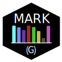

# Markg

<table>
  <tr>
    <td>
      
    </td>
    <td>
      Markg (The g is silent) stands for: Make A Really Kool (Graph) --it's a reference to a dear friend of mine-- and aims to be a way to generate custom graphs (with theming!) through web requests, useful for iframes in READMEs.  
      If you're looking at the repo right now, this might be a bit weird, it's empty.. why are you looking at it? Stop it
    </td>
  </tr>
</table>

# Warnings about dev time and quality
I'd like to point out that this project is not only still just empty, but is also being coded on the very low free time university leaves me to do what i like (not that i don't like what i study, ofc.. you get the idea).

I am glad if people contribute and all, and i'll try to actually finish this side project for once, but no garantees

That being said..

### How to contribute
I know my dev structure sucks but i have never actually done something serious, so if you have suggestions on how to change it, please open an issue!

1. Have the correct version of python installed, see below
2. Clone the repo and enter the project's folder
3. Create a python virtual environment and install the necessary packages with `pip install -r dev/requirements.txt` (or `pip install -r dev\requirements.txt` on Windows)
4. Create a `config.ini` file inside the `dev` folder (See below for config template)
5. Test if everything works by running the `launch.sh` script or the `launch.bat` depending on your OS
  - You can check if the server works by quering `http://localhost:<port>/embed?` which will default to a hello world message if everything works
6. Get to coding

### System Requirements
- Python: as of now the project is being developed with Python 3.12.4(latest as of writing), altough no testing for previous versions was done, be advised
